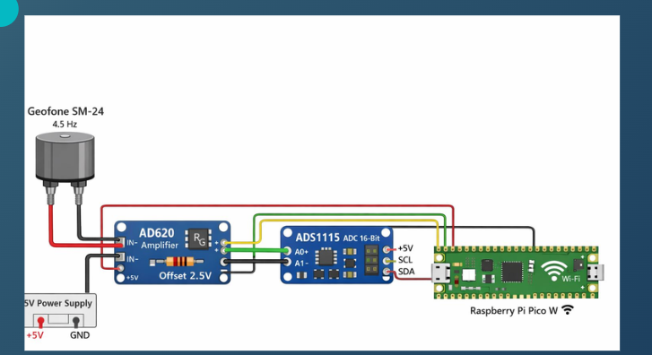
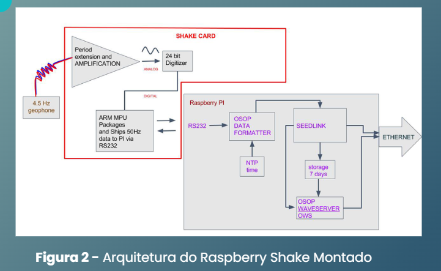

## Hardware Architecture and Signal Flow

The PULSE system was designed with a modular architecture, focusing on reliable data acquisition at a low cost, in contrast to closed, "plug-and-play" commercial solutions. The seismic signal flow from the ground to the microcontroller follows a rigorous conditioning chain:

**1. Physical Acquisition (SM-24 Geophone)**
Ground motion is captured by a 4.5 Hz geophone. This passive sensor generates an analog electrical signal directly proportional to the physical vibration velocity.

**2. Conditioning and Amplification (AD620)**
Since the raw signal has an amplitude in the millivolt range, it is routed to an AD620 instrumentation amplifier. At this stage, a 2.5V *offset* is injected into the circuit. This step is critical: it "centers" the analog wave at a positive value, preventing the negative peaks of the seismic signal from being clipped during reading.

**3. Analog-to-Digital Conversion (ADS1115)**
The conditioned and centered signal enters the analog pins (A0 and A1) of the 16-bit ADC converter (ADS1115). Using these two pins allows for a differential reading, reducing the board's common electrical noise.

**4. Processing and Telemetry (Raspberry Pi Pico W)**
The perfectly digitized data is transmitted to the microcontroller via the I2C communication bus. For this, we use the **SDA** (Serial Data) and **SCL** (Serial Clock) pins, sharing a common 5V power supply and Ground (GND) across the entire system.

---

### Comparison with the Market Standard

To validate our approach, we compared the PULSE architecture with the *Raspberry Shake*, a standard in amateur and educational seismology:

* **Modularity vs. Integration:** While the Raspberry Shake uses a factory-calibrated, integrated *Shake Card*, PULSE adopts a fully modular and *open-source* approach, allowing for isolated parts maintenance.
* **ADC Resolution:** The commercial system uses a 24-bit converter, offering higher theoretical precision. PULSE uses a 16-bit converter, which substantially reduces costs while remaining perfectly suitable for structural audit monitoring and macro-earthquakes.
* **Connectivity:** PULSE gains an advantage in field deployment flexibility, operating via Wi-Fi or 4G networks, unlike the traditional Ethernet dependency of other systems.

