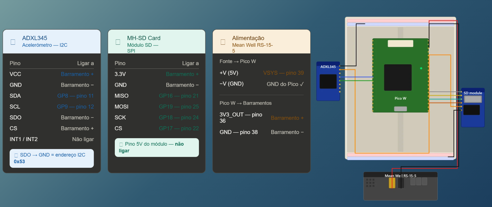

## Hardware Architecture & System Evolution

The PULSE system was developed through an iterative engineering process, evolving from an analog acquisition chain to a fully integrated digital modular system. This approach allowed us to optimize signal integrity, reduce electrical noise, and improve field reliability.

### Version 1: Analog Acquisition (Geophone)
The initial prototype focused on capturing physical velocity using a passive seismic sensor and conditioning the raw analog signal.
* **Physical Acquisition:** A 4.5 Hz SM-24 geophone captures ground motion.
* **Conditioning (AD620):** The millivolt-range signal is routed to an AD620 instrumentation amplifier, injecting a 2.5V offset to center the wave and prevent negative peak clipping.
* **Digitization (ADS1115):** The conditioned signal is read differentially via A0/A1 pins on a 16-bit ADC, which then sends the data to the microcontroller.

### Version 2: Digital Acquisition & Logging (Current System)
To optimize physical space inside the enclosure, eliminate analog electrical noise, and add local redundancy, the system was upgraded to utilize a digital MEMS accelerometer and local storage.
* **Digital Sensor (ADXL345):** A 3-axis digital accelerometer replaces the analog chain, communicating directly with the microcontroller via the I2C bus.
* **Local Storage (MH-SD Card):** An SPI-based SD card module was added to log data locally, ensuring no telemetry is lost in the event of a network or cloud failure.
* **Power Management:** The entire system is powered by an industrial-grade Mean Well RS-15-5 power supply, stepping down mains voltage to a stable 5V for continuous operation.

---

### V2 Wiring & Pinout Guide

To replicate the current PULSE digital system, follow the exact wiring tables below for the Raspberry Pi Pico W.

#### 1. ADXL345 Accelerometer (I2C)
The accelerometer communicates via I2C. Connecting the SDO pin to Ground hardwires the I2C address to `0x53`.

| ADXL345 Pin | Pico W / System Connection | Notes |
| :--- | :--- | :--- |
| **VCC** | 3.3V Bus | Power |
| **GND** | Ground Bus (-) | Ground |
| **SDA** | GP8 (Pin 11) | I2C Data |
| **SCL** | GP9 (Pin 12) | I2C Clock |
| **SDO** | Ground Bus (-) | Sets address to 0x53 |
| **CS** | 3.3V Bus (+) | Chip Select (High for I2C) |
| **INT1 / INT2**| *Not connected* | Interrupt pins |

#### 2. MH-SD Card Module (SPI)
This module is used for local CSV logging. *Note: Do not connect the 5V pin of this module.*

| SD Module Pin | Pico W Connection |
| :--- | :--- |
| **3.3V** | 3.3V Bus |
| **GND** | Ground Bus (-) |
| **MISO** | GP16 (Pin 21) |
| **MOSI** | GP19 (Pin 25) |
| **SCK** | GP18 (Pin 24) |
| **CS** | GP17 (Pin 22) |

#### 3. Power Supply (Mean Well RS-15-5)

| Power Supply | Pico W Connection |
| :--- | :--- |
| **+V (5V)** | VSYS (Pin 39) |
| **-V (GND)** | GND (Pin 38) |

---

### Comparison with the Market Standard

To validate our approach, we compared the PULSE architecture with the *Raspberry Shake*, a standard in amateur and educational seismology:

* **Modularity vs. Integration:** While the Raspberry Shake uses a factory-calibrated, integrated *Shake Card*, PULSE adopts a fully modular and *open-source* approach, allowing for isolated parts maintenance.
* **ADC Resolution:** The commercial system uses a 24-bit converter, offering higher theoretical precision. PULSE uses a 16-bit converter, which substantially reduces costs while remaining perfectly suitable for structural audit monitoring and macro-earthquakes.
* **Connectivity:** PULSE gains an advantage in field deployment flexibility, operating via Wi-Fi or 4G networks, unlike the traditional Ethernet dependency of other systems.

