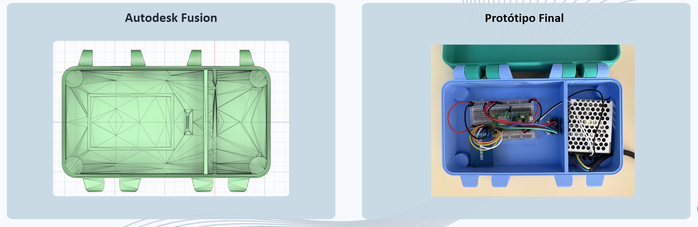
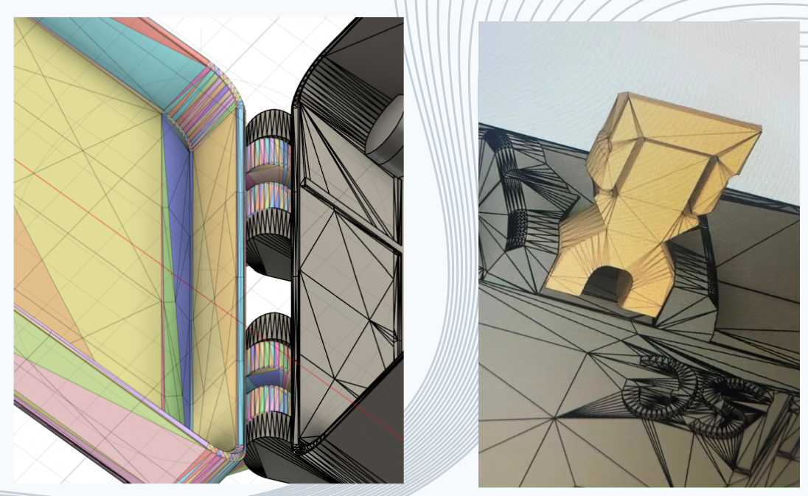
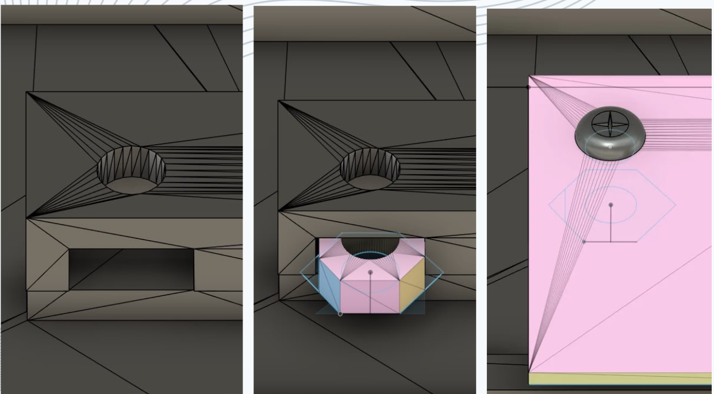
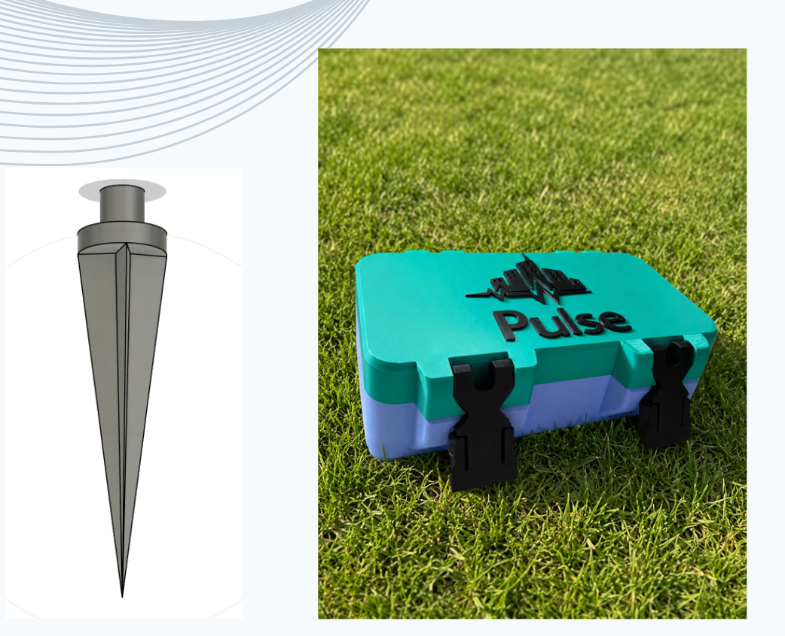

#### 3D Design & Final Enclosure

O desenvolvimento mecânico do PULSE foi inteiramente modelado no Autodesk Fusion, garantindo proteção e acomodação exata de todos os componentes eletrónicos.

**Visão Geral: Autodesk Fusion vs. Protótipo Final**

**Mecânica de Fecho**
O sistema de fecho foi desenvolvido sem parafusos, usando um encaixe por interferência entre a tampa e o corpo da caixa.

**Suporte Interno do Acelerómetro**
Para garantir a integridade do sinal sísmico, o acelerómetro é fixado no interior da caixa através de um suporte rígido com roscas e parafusos.

**Fixação ao Terreno (Acoplamento Acústico)**
Para uma leitura precisa das vibrações no solo, foram implementados espigões de suporte de canal, que passam diretamente pela base da caixa e servem de extensão acústica da caixa.

